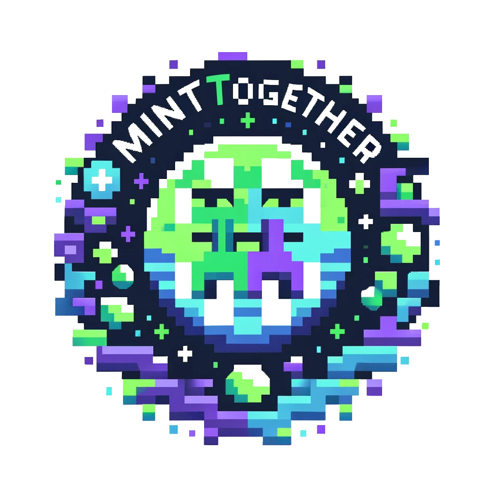
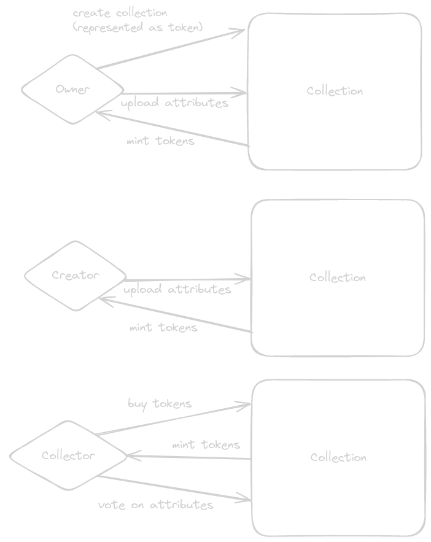
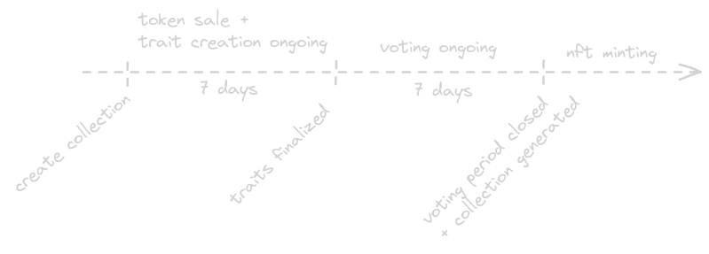

  <h1 align="center">MINT TOGETHER </h1>  
  <h3>pump.fun for nft's</h3>
  
  

**MINT TOGETHER** is an NFT launchpad for community-generated art, inspired by the success of pump.fun. This platform aims to create NFT collections collaboratively, with a community-driven approach to attribute creation and rarity determination.

## Inspiration

- Success of pump.fun
- The challenge of building a similar platform for NFTs

## Idea

MINT TOGETHER focuses on community-created NFT collections with the following features:

- **Token-based minting:** Buy and sell tokens that are used to mint NFTs.
- **Community-driven creation:** Collections are created by the community.
- **User contributions:** Users can upload new attributes and vote for them.
- **Token locking:** Voting locks tokens, making sure prizes go up only.
- **Token locking:** Collections are generated dynamically based on community votes after the creation/voting period ends.

### Detailed Flow

1. **Owner creates a collection:**

   - Sets the collection's name and description.
   - Determines the attributes (e.g., body, shirt, weapon).
   - Uploads images for these attributes.

2. **Creators add to the collection:**

   - Buy shares (tokens) for the collection.
   - Upload images for attributes.

3. **Collectors vote on :**
   - Buy shares (tokens) for the collection.
   - Vote on their favorite attributes.

**Note:** Voting locks tokens until the collection is generated. Uploading new attributes also locks tokens and counts as a vote for that attribute.

### Flow - Timeline

1. Owner creates and sets up the collection.
2. Creators and collectors participate by buying tokens, uploading images, and voting on attributes.
3. Tokens are locked during voting.
4. Collection is generated dynamically based on the final votes after the voting period closes.

## Next Steps

- Develop creation and voting pages.
- Implement admin functions to approve/remove attributes.
- Introduce royalties for Owners and Creators.
- Finalize tokenomics:
  - Decide between bonding curve or fixed token price.
  - Determine if there will be a fixed number of tokens or a fixed sale period.

## Links

[Presentation slides](https://docs.google.com/presentation/d/1X5y4KVVY_62WxXtADXpi1Ruli4q3Z7MkqV_SyJb4RvY/edit?usp=sharing)

## Team

[@arjanjohan](https://twitter.com/arjanjohan)
